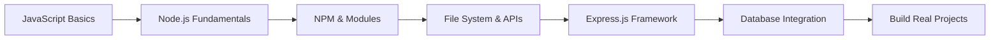

# **What is Node.js? 🚀**

Node.js is **a cross-platform, open-source JavaScript runtime environment** that can run on Windows, Linux, Unix, macOS, and more. It runs on the V8 JavaScript engine and executes JavaScript code outside a web browser. Node.js allows developers to use JavaScript to write command line tools and for server-side scripting.

> **💡 Key Insight:** Node.js represents a "JavaScript everywhere" paradigm, unifying web-application development around a single programming language, as opposed to using different languages for the server-versus client-side programming.

---

## **🎯 Why Node.js?**

### **Traditional Web Development Problem**
- **Frontend**: JavaScript, HTML, CSS
- **Backend**: PHP, Python, Java, C# (Different language!)
- **Database**: SQL queries
- **Result**: Context switching between multiple languages 😵

### **Node.js Solution**
- **Frontend**: JavaScript ✅
- **Backend**: JavaScript ✅  
- **Database**: JavaScript (with MongoDB) ✅
- **Result**: One language to rule them all! 🎉

---

## **🔥 Key Features**

| Feature | Description | Benefit |
|---------|-------------|---------|
| **🚄 Fast & Efficient** | Built on Google's V8 engine | Lightning-fast execution |
| **⚡ Non-blocking I/O** | Asynchronous operations | Handle thousands of connections |
| **📦 NPM Ecosystem** | World's largest package registry | 1M+ ready-to-use packages |
| **🔄 Single-threaded** | Event-driven architecture | Memory efficient |
| **🌐 Cross-platform** | Write once, run anywhere | Deploy on any OS |

---

## **🛠️ What Can You Build?**

### **Web Applications**
- 🌐 **REST APIs** - Backend services for mobile/web apps
- 🖥️ **Full-stack Web Apps** - Complete web solutions
- 🔄 **Real-time Apps** - Chat applications, live updates

### **Desktop & Mobile**
- 📱 **Mobile Apps** - Using React Native
- 💻 **Desktop Apps** - Using Electron (VS Code, Discord, Spotify)

### **Other Cool Stuff**
- 🤖 **Command Line Tools** - Automation scripts
- 🎮 **Game Servers** - Multiplayer game backends  
- 🔗 **Microservices** - Scalable distributed systems
- 🤖 **IoT Applications** - Internet of Things devices

---

## **📈 Why Companies Love Node.js**

### **Big Names Using Node.js:**
- 🛒 **E-commerce**: PayPal, Shopify, eBay
- 🎵 **Entertainment**: Netflix, Spotify, YouTube
- 💬 **Social**: Facebook, Twitter, LinkedIn  
- 🚗 **Transportation**: Uber, Airbnb

### **Business Benefits:**
- ⚡ **Faster Development** - Same language for frontend/backend
- 💰 **Cost Effective** - Fewer developers needed
- 🚀 **High Performance** - Handle more users with less resources
- 📊 **Scalable** - Easy to scale applications

---

## **🎓 Learning Path for Beginners**



### **Step-by-Step Guide:**
1. **📚 Master JavaScript** - Variables, functions, promises, async/await
2. **🏗️ Learn Node.js Basics** - Modules, file system, HTTP
3. **📦 Understand NPM** - Installing packages, package.json
4. **🌐 Build APIs** - REST APIs with Express.js
5. **🗄️ Connect Databases** - MongoDB, MySQL integration
6. **🚀 Deploy Applications** - Heroku, AWS, Vercel

---

## **⚡ Quick Example**

Here's a simple web server in just 4 lines of code:

```javascript
const http = require('http');

const server = http.createServer((req, res) => {
    res.writeHead(200, {'Content-Type': 'text/html'});
    res.end('<h1>Hello World from Node.js! 🎉</h1>');
});

server.listen(3000, () => {
    console.log('Server running at http://localhost:3000/');
});
```

**That's it!** Run `node server.js` and visit `http://localhost:3000` 🎯

---

## **🆚 Node.js vs Others**

| Language | Learning Curve | Performance | Community | Job Market |
|----------|----------------|-------------|-----------|------------|
| **Node.js** | 🟢 Easy | 🟢 Fast | 🟢 Huge | 🟢 High Demand |
| **Python** | 🟢 Easy | 🟡 Moderate | 🟢 Large | 🟢 High |
| **Java** | 🔴 Hard | 🟢 Fast | 🟢 Mature | 🟢 High |
| **PHP** | 🟡 Moderate | 🟡 Moderate | 🟢 Large | 🟡 Declining |

---

## **🚀 Getting Started Today**

### **Installation (3 simple steps):**
1. **Download**: Visit [nodejs.org](https://nodejs.org)
2. **Install**: Run the installer for your OS
3. **Verify**: Open terminal and type `node --version`

### **Your First Node.js App:**
```bash
# Create a new folder
mkdir my-first-node-app
cd my-first-node-app

# Create package.json
npm init -y

# Install Express.js
npm install express

# Create app.js and start coding! 🎉
```

---

## **📚 Amazing Resources**

- 📖 **Official Docs**: [nodejs.org/docs](https://nodejs.org/docs)
- 🎥 **Free Courses**: freeCodeCamp, YouTube tutorials
- 📦 **Package Registry**: [npmjs.com](https://npmjs.com)
- 💬 **Community**: Reddit r/node, Stack Overflow
- 🎯 **Practice**: Build a todo app, chat app, or blog!

---

## **💡 Fun Facts**

- 🎂 **Born in 2009** - Created by Ryan Dahl
- 📊 **50+ billion downloads** - NPM packages downloaded monthly  
- 🏢 **Used by 90%+ Fortune 500** - It's everywhere!
- ⚡ **Netflix saves $1B yearly** - Thanks to Node.js performance
- 🚀 **NASA uses Node.js** - For space mission critical applications!

---

**Ready to join the Node.js revolution? Let's build something amazing together! 🚀✨**

---

*⭐ Star this repo if you found it helpful! Contributions and feedback are always welcome.*
